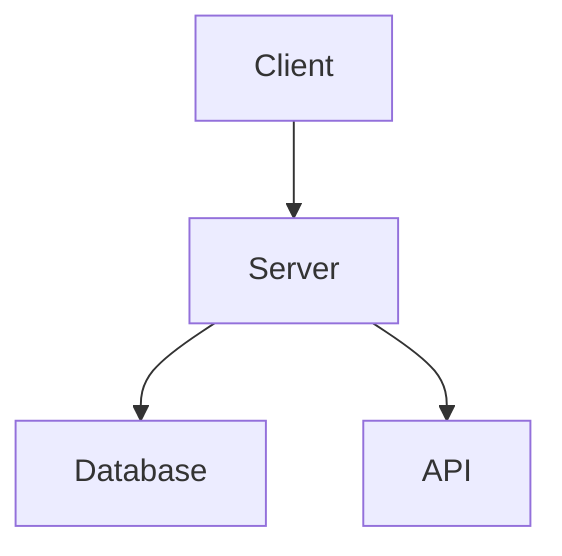
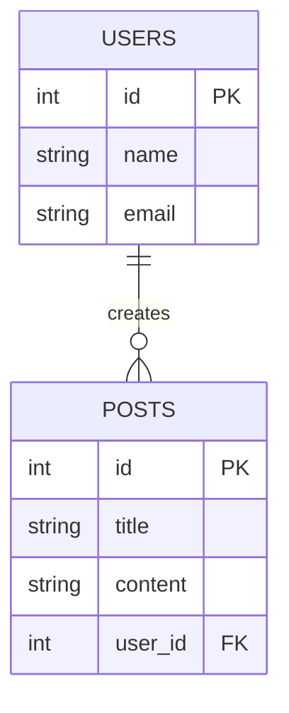
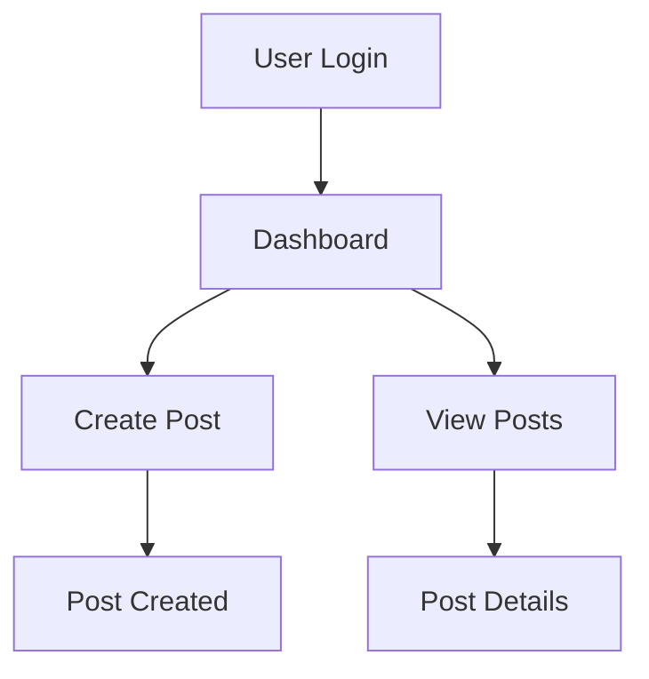

# Project Documentation

## System Architecture

```mermaid
graph TD;
    A[Client] --> B[Server];
    B --> C[Database];
    B --> D[API];
```

## Database Design

```mermaid
erDiagram
    USERS {
        int id PK 
        string name 
        string email 
    }
    POSTS {
        int id PK 
        string title 
        string content 
        int user_id FK 
    }
    USERS ||--o{ POSTS : creates
```

## User Workflows

```mermaid
flowchart TD
    A[User Login] --> B[Dashboard]
    B --> C[Create Post]
    B --> D[View Posts]
    C --> E[Post Created]
    D --> F[Post Details]
```
